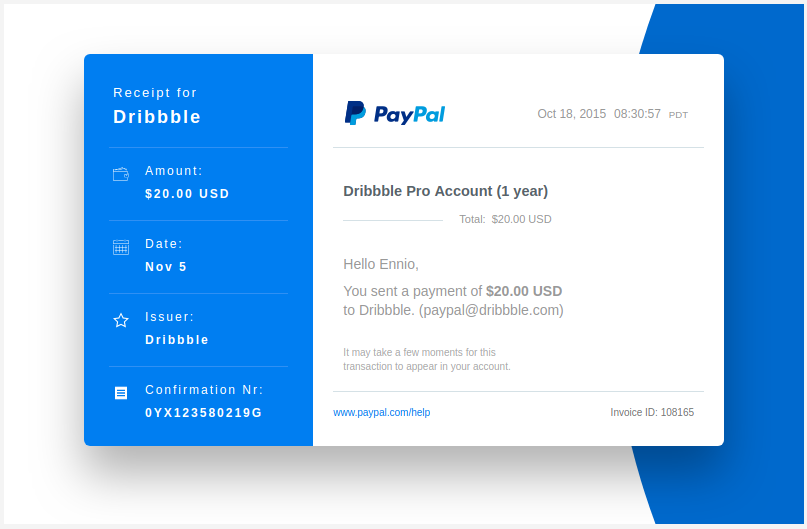

# dribbbling code

This repo is for reproductions of dribbble designs in code.  It is for personal experimentation of the powers of css.

Since I do not use this to test css in all browsers, the following are samples of what I produced on Chrome Version 67.0.3396.87

### Architecture Weather

### Credit Card

### Email Receipt

